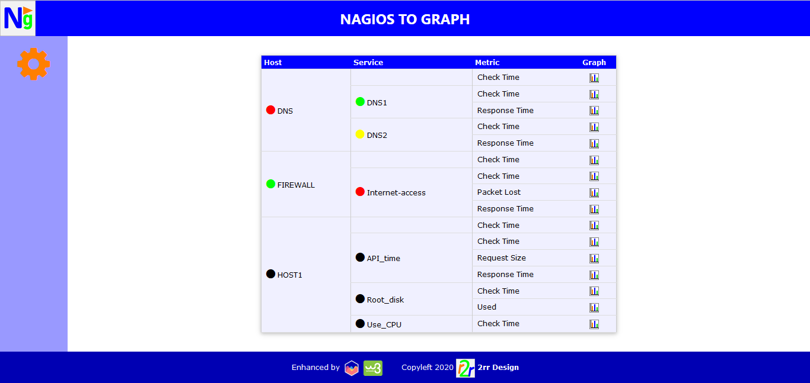
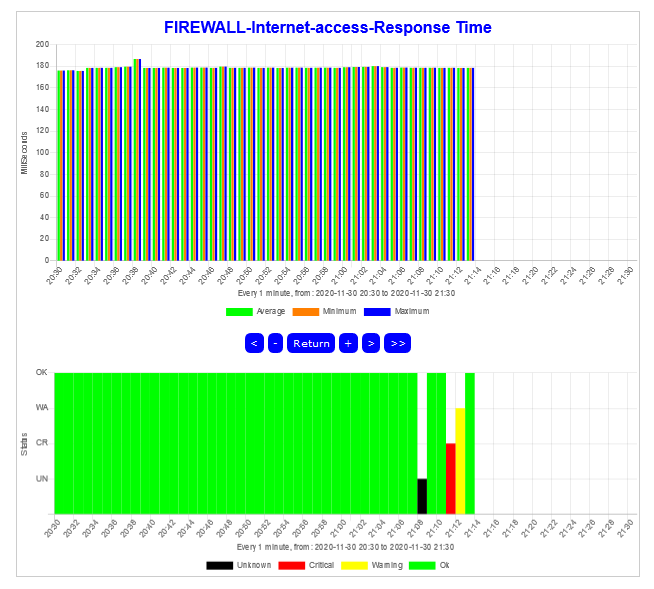

# n2graph
### Tool to graph nagios's performance data

This tool collects in background performance data from nagios's log files and stores it in a mysql database. Then a web interface shows that data in graphs. 

The goal of this project is to provide a tool that doesn't require expertise to install it (although minimal knowledge is required to work with a LAMP stack), and be friendly to configure and use. 

### Features

-Metrics can be showed grouped in periods of: minutes, 10 minutes, hours, days and months.

-Minimum, maximum and average metrics.

-Can navigate forward and backward in time.

-Collects and shows also check times. 

-Developed in PHP and uses Chart.js and W3.CSS libraries.

-Requires a LAMP stack.

### Screenshots

| ||

### Install

Install instructions can be found [here](docs/INSTALL.md).

### Last words

I hope this tool be useful to you. Any feedback will be appreciated. Do not hesitate to ask for help if you experience any trouble installing or using it.
Enjoy!

